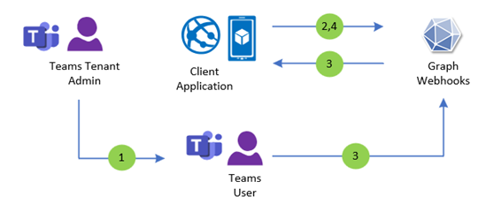

# Get change notifications for Microsoft Teams emergency call event updates

Microsoft Teams supports notifications with emergency calls which can be routed to inform specific security personnels within Teams. Graph emergency call events notification extends that capability to allow emergency calling notifications to be received outside of Teams (i.e. your own client application) as shown in the diagram below. 



1.	The Teams tenant admin configures [emergency calling](https://learn.microsoft.com/en-us/microsoftteams/configure-dynamic-emergency-calling) for the tenant.
2.	The client application creates a Graph emergency call event subscription. 
3.	When a Teams user makes an emergency call (i.e. dial 911) on Teams, the emergency call event notification is fired to the client application. 
4.	To continue to be subscribed to emergency call event notifications, the client application will either [renew](/graph/api/subscription-update) the existing subscription before the expiry period or [create](/graph/api/subscription-post-subscriptions) a new one after the expiry period.


## Permissions 

| Permission type                       | Permissions (from least to most privileged)              | Supported versions |
|:--------------------------------------|:---------------------------------------------------------|:-------------------|
| Delegated (work or school account)    | Not supported.                                       | Not supported.          |
| Delegated (personal Microsoft account) | Not supported.                                           | Not supported.     |
| Application                           | CallEvents-Emergency.Read.All                                         | beta.     |

## Subscribe to emergency call started events

To subscribe to when an applicable emergency call policy number is dialed, set the `resource` property in the subscription payload to `communications/calls/getEmergencyEventsByPolicy(policyName='{policyName}')` where the `{policyName}` field must be replaced with the policy name configured for your organization.

Subscriptions for emergency call events only support rich notifications. Please set `includeResourceData` to `true` and provide appropriate values for `encryptionCertificate` and `encryptionCertificateId`. For more information on creating subscriptions with rich notifications, see [Set up change notifications that include resource data](/graph/webhooks-with-resource-data).

Subscriptions for emergency call events have a **max expiration period of 1 day**. To keep subscriptions for longer durations, a subscription patch must be made to update the `expirationDateTime` property. See [Update subscription API](/graph/api/subscription-update) for more details.

> [!NOTE]
> Subscriptions are limited **one subscription per application, per tenant, and per unique policy name**. A duplicated subscription using the same application, tenant, and to the same emergency policy will return conflict.

### Subscription payload example

```http
POST https://graph.microsoft.com/beta/subscriptions
Content-Type: application/json

{
  "changeType": "updated",
  "notificationUrl": "https://contoso.com/notificationUrl",
  "resource": "communications/calls/getEmergencyEventsByPolicy(policyName='EmergencyPolicy')",
  "includeResourceData": true,
  "encryptionCertificate": "{base64encodedCertificate}",
  "encryptionCertificateId": "{customId}",
  "expirationDateTime": "2021-02-01T11:00:00.0000000Z",
  "clientState": "{secretClientState}"
}
```

## Emergency call event notifications

Notifications for emergency calls are triggered when a call with an applicable emergency call policy is initiated.
Rich notifications

### Notification payload example

```http
POST https://contoso.com/notificationUrl
Content-Type: application/json

{
  "value": [{
    "subscriptionId": "{Subscription id}",
    "clientState": "{secret client state}",
    "changeType": "updated",
    "tenantId": "00000000-0000-0000-0000-000000000000",
    "resource": "communications/calls/getEmergencyEventsByPolicy(policyName='EmergencyPolicy')",
    "subscriptionExpirationDateTime": "2021-02-01T11:00:00.0000000Z",
    "resourceData": {
        "@odata.id": "communications/calls/getEmergencyEventsByPolicy(policyName='EmergencyPolicy')",
        "@odata.type": "#microsoft.graph.emergencyCallEvent",
        "id": "11111111-0000-0000-0000-000000000000",
    },
    "organizationId": "00000000-0000-0000-0000-000000000000",
    "encryptedContent": {
      "data": "{Encrypted content}",
      "dataSignature": "{Encrypted data signature}",
      "dataKey": "{Encrypted data key for encrypting content}",
      "encryptionCertificateId": "{User specified id of encryption certificate}",
      "encryptionCertificateThumbprint": "{Encrpytion certification thumbprint}"
    }
  }],
  "validationTokens": ["{Validation Tokens}"]
}
```


### Decrypted notification resource data example

```json
{
    "@odata.id": "communications/calls/getEmergencyEventsByPolicy(policyName='EmergencyPolicy')",
    "@odata.type": "#microsoft.graph.emergencyCallEvent",
    "id": "11111111-0000-0000-0000-000000000000",
    "emergencyCallEvent": { 
        "id": "11111111-0000-0000-0000-000000000000",  
        "callEventType": "callStarted",
        "policyName": "EmergencyPolicy",
        "eventDateTime": "2024-01-01T10:00:00.0000000+00:00",
        "emergencyNumberDialed": "{emergencyNumberDialed}",
        "callerInfo": {
            "displayName": "Emergency caller display name", 
            "upn": "emergencyCaller@contoso.com", 
            "phoneNumber": "00000000000",
            "tenantId": "00000000-0000-0000-0000-000000000000",
            "location": {
                "uniqueId": "00000000-0000-0000-0000-000000000000",
                "address": {
                    "street": "Microsoft Way",
                    "city": "Redmond",
                    "state": "WA",
                    "countryOrRegion": "United States",
                    "postalCode": "00000",
                    "additionalData": {
                    "companyName": "Company name",
                    "additionalInfo": "700",
                    "houseNumber": "725",
                    "county": "County",
                    "description": "Location description",
                    "streetSuffix": "Street suffix"
                    }
                },
                "coordinates": {
                    "latitude": "00.0000",
                    "longitude": "00.0000"
                }
            }
        }
    }
}
```

## Related content
- [Change notifications through webhooks](change-notifications-delivery-webhooks.md)
- [Microsoft Graph API change notifications](/graph/api/resources/change-notifications-api-overview)
