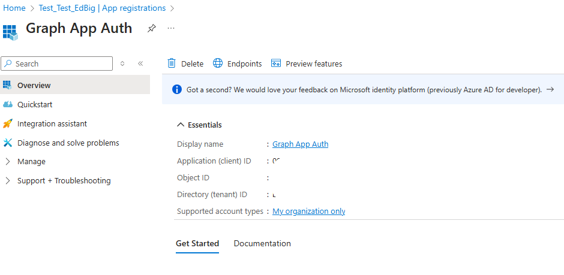
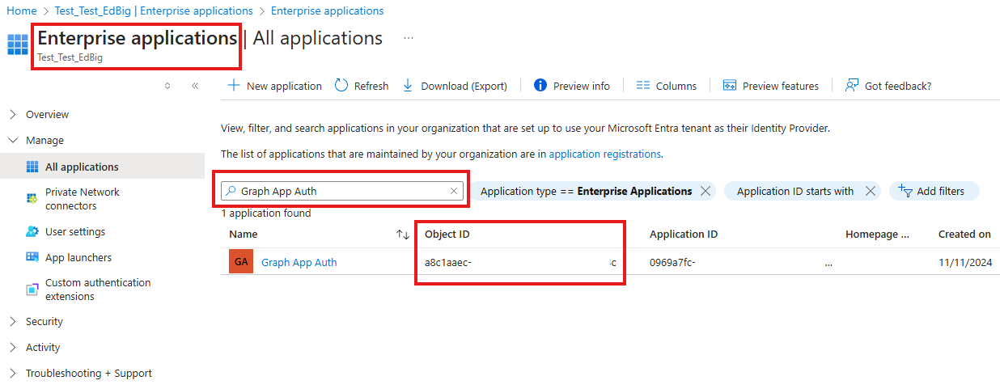
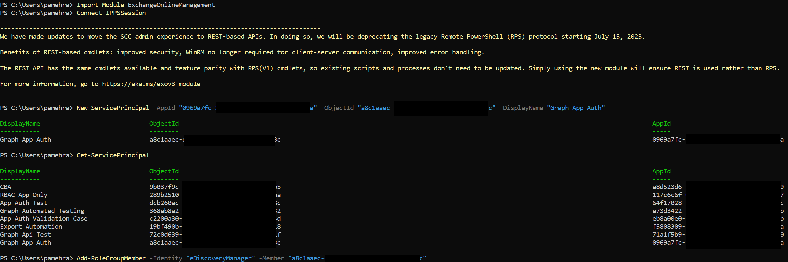

# Setting up App Authentication for Purview eDiscovery with Microsoft Graph API

In the world of data compliance and legal investigations, Purview eDiscovery plays a crucial role in managing and retrieving information across your organization�s digital landscape. In this age where data breaches are becoming more frequent and the regulatory requirements are more stringent, the security and integrity of eDiscovery processes have never been more critical.  Traditional authentication methods often fall short when it comes to providing the necessary security and compliance guarantees, especially in complex enterprise environments. This is where App Authentication steps in as a game-changer for Purview eDiscovery, leveraging Microsoft Graph API. 

Implementing App Authentication using Microsoft Graph API ensures secure and efficient access to needed resources. This step-by-step guide walks you through setting up App Authentication for Purview eDiscovery, ensuring your applications are compliant and secure.

## Why App Authentication?

### Enhancing Security and Compliance

App Authentication enhances the security landscape of Purview eDiscovery by implementing robust authentication protocols that standard user credentials cannot match. By using Application (client) IDs and certificates for authentication, we minimize the risk of credential theft, which is a common vulnerability in standard authentication methods. This approach not only secures the application against unauthorized access but also ensures that the data integrity is maintained during the eDiscovery process.

### Streamlining Access and Integration

Furthermore, App Authentication streamlines the integration of eDiscovery services with other applications and systems. It facilitates automated, script-based interactions that are crucial for large-scale legal investigations and compliance audits. By allowing secure, token-based access to eDiscovery resources, organizations can automate workflows, reduce manual errors, and ensure consistent enforcement of compliance policies across all digital environments.

## Implementing App Authentication

Listed below are step by step instructions to implement App Auth. The basic steps involve registering the app in Azure, creating client secret/ certificates, assigning the right API permissions, setting up a service principal and then using App Auth for invocation.

### Step 1: Register a New Application in Azure

1.1 To begin, navigate to the Azure portal and sign in with your Microsoft account.

1.2 Access the Microsoft Entra ID section on the left side.

1.3 Go to App registrations, select New registration.

1.4 Provide a meaningful name for your application and click register to create your new app registration. This process will generate essential details such as the Application (client) ID and Directory (tenant) ID, which are crucial for future steps.

1.5 You can now see the newly created app registration and the details.

### Step 2: Create Client Secrets or Certificates

Once your app is registered, proceed to **Manage > Certificates & secrets**. Here, you can create a client secret or upload a certificate, depending on your authentication needs:

For a client secret, click New client secret, add a description, and click Add to save. Make sure to copy and securely store the secret value, as required for authentication.

If using a certificate, you can upload one to use along with the App ID for automation purposes.

### Step 3: Assign API Permissions

Next, you need to set the correct API permissions for your application. Under API permissions, add eDiscovery.Read.All and eDiscovery.ReadWrite.All. These permissions enable your app to read or write eDiscovery data, respectively. It's essential that the tenant admin consents to these Application permissions to enable them for use.

### Step 4: Set Up a Service Principal

4.1 In the Azure portal > Microsoft Entra ID, navigate to **Enterprise Applications** to get the Object ID for your application. 

4.2 Now open a new PowerShell session to create a service principal that you can add to the eDiscoveryManager role group:

Install and import the ExchangeOnlineManagement module if not already installed.

    Install-Module ExchangeOnlineManagement (if not already installed)

    Import-Module ExchangeOnlineManagement

    Connect-IPPSSession

Use New-ServicePrincipal to create a service principal with your app's details and add it to the eDiscoveryManager role using Add-RoleGroupMember.

    New-ServicePrincipal -AppId "71a1f5b9-3c69-4bbd-8579-2b3a2d70f7a0" -ObjectId "72c0d639-8c8f-439b-bbbe-78c9ce51751f" -DisplayName "Graph Api Test"

    Get-ServicePrincipal

    Add-RoleGroupMember -Identity "eDiscoveryManager" -Member "72c0d639-8c8f-439b-bbbe-78c9ce51751f"

Verify the setup using Get-RoleGroupMember.

    Get-RoleGroupMember -Identity "eDiscoveryManager"

    Add-eDiscoveryCaseAdmin -User "72c0d639-8c8f-439b-bbbe-78c9ce51751f"

    Get-eDiscoveryCaseAdmin

### Step 5: Connect to Graph API Using App Authentication

Finally, use the [Connect-MgGraph](https://learn.microsoft.com/powershell/module/microsoft.graph.authentication/connect-mggraph) command to authenticate and connect to Graph API using the app authentication method. This setup enables your app to interact with Microsoft Graph securely.

### Step 6: Invoke Graph API Requests

Once connected, you can start making calls to the Graph API using [Invoke-MgGraphRequest](https://learn.microsoft.com/powershell/module/microsoft.graph.authentication/invoke-mggraphrequest). This method allows you to perform various operations required by eDiscovery services in your organization.

## References

For API testing on postman, see [Use Postman with the Microsoft Graph API](https://learn.microsoft.com/graph/use-postman).